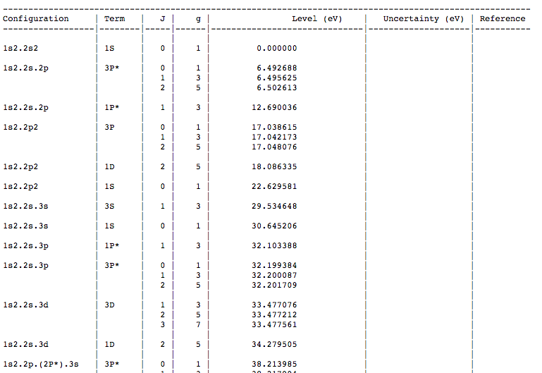

# AtomicQuery
This is an experimental package for the sake of hashing atomic data by (configuration, term, J) level information instead of (idxI, idxJ), so that an Atom object is able to be created by given the information of necessary levels without editing the data file.

---

## Available Atomic model

| Atom & ionization stage | Available Terms | nLevel | Ref : Level & Aji | Ref: electron impact ECS | Ref: proton impact ECS |
|:-----------------------:|:----------------|:-----|:-----|:----------------|:-------------------------|
| C III | "1s2.2s2 1S" - "1s2.2p2 1S" | 10 | NIST | [Berrington et al. 1985](.ref/ECS/Berrington_et_al_1985.pdf) | not yet |
| O V | "1s2.2s2 1S" - "1s2.2p2 1S" | 10 | NIST | [Berrington et al. 1985](.ref/ECS/Berrington_et_al_1985.pdf) | not yet |
| Si III | "1s2.2s2.2p6.3s2 1S"- "1s2.2s2.2p6.3d.4d 1S" | 141 | [Kanti 2017](./ref/ECS/Kanti_2017.pdf) | [Kanti 2017](./ref/ECS/Kanti_2017.pdf) | not yet |

## Formatting files in database

### 1. Copy Level information and Einstein Aji coefficient from NIST database {: Developer}

For instance, we need the information of C^{2+}.

|  |
|:---:|
| Fig 1. |

|  |
|:---:|
| Fig 2. |

### 2. Formatting Level data (Config) {: Developer}

### 3. Formatting Aji and Wavelength data (Database) {: Developer}

### 4. Formatting Effective Collision Strength data for Collisional Excitation (database) {: Developer}

### 5. Construct `Atom()` instances (User interface) {: User}
